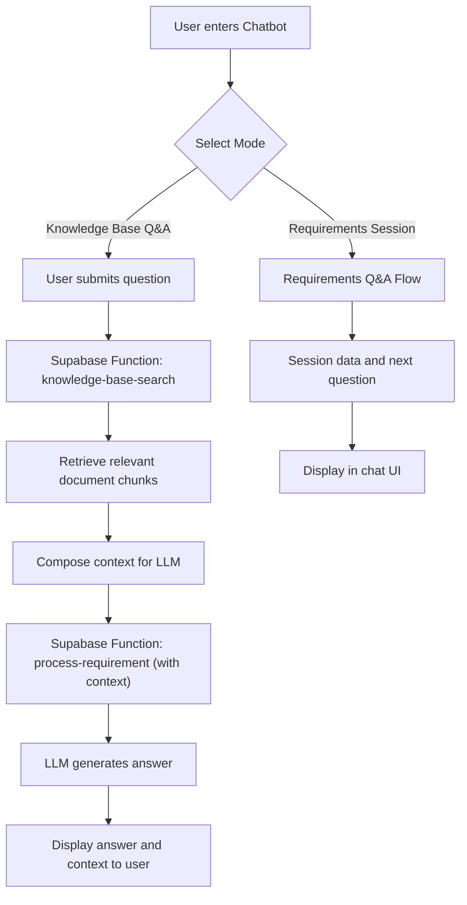

# AI Platform Consultant – No-Code, Multi-Vertical Solution Generator

## Overview

This web app is a turnkey, no-code AI consultant platform designed for enterprises to automate, deploy, and manage private AI solutions across key industry verticals (HR, Finance, Legal, Manufacturing, etc.). It enables non-technical users and executives to:
- Generate complete AI architectures (LLM, RAG, vector DB, workflows)
- Estimate costs in real time
- Deploy and manage models and infrastructure
- Access pre-built workflow templates
- Monitor KPIs and business impact
- Ensure compliance and security

The platform is modular, extensible, and ready for multi-model, multi-vertical use cases.

---

## Key Features

- **No-Code, Multi-Vertical UI:** Wizard-driven, supports HR, Finance, Legal, Manufacturing, and more
- **Cost Estimator:** Real-time, detailed, integrated into requirements flow and as a standalone page
- **n8n Workflow Library:** Pre-built, installable templates for document ingestion, automation, notifications
- **RAG/Vector DB:** ChromaDB integrated; architecture supports LlamaIndex, Weaviate, Qdrant
- **Multiple LLMs:** UI and backend support for Gemini, Claude, GPT-4, LLaMA 3, and local models
- **Compliance & Security:** Domain-specific compliance cost calculations, audit logging, JWT auth
- **Executive Dashboard:** KPI metrics, ROI analysis, usage analytics, recommendations
- **Admin Model Config:** Manage LLMs, vector DBs, GPU deployment, and settings
- **Extensible/Modular:** PlatformBuilder, RequirementWizard, CostEstimator, and AdminPage are modular and ready for new verticals
- **Knowledge Base Q&A Chatbot:** Unified chat interface now supports a Knowledge Base Q&A mode. Users can ask free-form questions, which are answered using the uploaded documents via a RAG pipeline. No duplicate upload or management UI—single interface for all knowledge base operations. (See version-log.yaml)

---

## Step-by-Step Usage Guide

1. **Access the Platform**
   - Visit the main dashboard at `/` for quick actions and navigation.

2. **Estimate Costs**
   - Click the **Cost Estimator** card or go to `/cost-estimator`.
   - Adjust parameters (data volume, users, model, GPU, etc.) to get real-time, line-item cost breakdowns.

3. **Build a Platform**
   - Click the **Platform Builder** card or go to `/platform-builder`.
   - Complete the **Requirement Wizard** (domain, requirements, compliance, etc.).
   - Review the cost estimate (step 5) and finalize your specification.
   - Generate architecture, infrastructure, and workflow artifacts.
   - Deploy using the integrated DevOps dashboard.

4. **Manage Knowledge Base**
   - Use the **Knowledge Base** card to upload and manage documents for RAG.
   - In the **Chatbot**, switch to "Knowledge Base Q&A" mode to ask questions grounded in your uploaded documents. The system retrieves relevant chunks and generates an answer using the LLM.

5. **Monitor and Analyze**
   - Use the **Analytics** card for observability and performance metrics.
   - Access the **Executive Dashboard** (via `/admin`) for KPIs, ROI, and strategic recommendations.

6. **Admin & Configuration**
   - Go to `/admin` for model/vector DB management, workflow library, and advanced settings.

7. **Install and Preview Workflows**
   - Use the **Workflow Library** tab in Admin to browse, preview, and install n8n workflow templates for various verticals.

8. **Scenario Planning**
   - Use the Cost Estimator and Platform Builder for scenario planning and executive decision support.

---

## Knowledge Base Q&A Event Flow



---

## Modular Version Log

See `version-log.yaml` for a full history of modular changes and rollbacks.

---

## Production Deployment & Feature Validation

**The UI remains user-friendly and unchanged for non-technical users. The following steps are for technical users/admins to validate and operate the new infrastructure features:**

### 1. **Deploy LLaMA 3 70B and Mistral 7B on CoreWeave**
- See `README-deployment.md` for full details.
- Set your Hugging Face token:
  ```bash
  export HUGGING_FACE_TOKEN="your_token_here"
  ```
- Deploy all models:
  ```bash
  ./scripts/deploy-all-models.sh
  ```
- Monitor deployment:
  ```bash
  ./scripts/gpu-monitor.sh
  kubectl get pods -n ai-models
  ```
- Scale up/down as needed:
  ```bash
  ./scripts/scale-model.sh up   # or down
  ```

### 2. **Validate Model Endpoints**
- Test LLaMA 3 70B:
  ```bash
  curl -X POST http://llama3-70b-service:8000/v1/completions \
    -H "Content-Type: application/json" \
    -d '{"model": "meta-llama/Meta-Llama-3-70B-Instruct", "prompt": "Hello", "max_tokens": 50}'
  ```
- Test Mistral 7B:
  ```bash
  curl -X POST http://mistral-service:8000/v1/completions \
    -H "Content-Type: application/json" \
    -d '{"model": "mistralai/Mistral-7B-Instruct-v0.2", "prompt": "Hello", "max_tokens": 50}'
  ```

### 3. **Check Multi-Model Abstraction**
- In the Admin UI (`/admin`), use the Model Config tab to switch between LLaMA, Mistral, and Gemini.
- The backend (`ModelManager`, `LLM Gateway`) will route requests to the selected model.
- All model usage and costs are tracked.

### 4. **Validate RAG and Vector Store Integrations**
- In the Admin UI or via API, configure and test ChromaDB, Weaviate, and Qdrant.
- Use the VectorSearch component to run semantic search across real vector stores.
- Ingest documents and verify chunking, embedding, and retrieval.
- Test via API:
  ```bash
  curl -X POST http://your-app/api/rag/search \
    -H "Content-Type: application/json" \
    -d '{"query": "test query", "store": "chromadb-default"}'
  ```

### 5. **Monitor and Optimize**
- Use `./scripts/gpu-monitor.sh` for GPU and model health.
- Use the Executive Dashboard in the UI for KPIs and business metrics.
- Use scaling scripts and resource quotas to optimize costs.

### 6. **Scenario: End-to-End Validation**
- Build a platform in the UI, select a model and vector store, ingest documents, and run a search.
- Confirm that:
  - The correct model is used (check logs or Admin UI)
  - The correct vector store is queried
  - Results are returned and displayed in the UI

---

## Deployment Progress (2025-07-31)

### ✅ Completed (High & Medium Priority)
- All API endpoints mapped to PRD and implemented.
- Audit logging (Supabase RLS, API, GitOps, N8N, compliance).
- Compliance scan integration: tfsec/Checkov, dashboard, compliance_results table.
- Artifact generation: Kubernetes, Terraform, CI/CD, n8n workflow templates.
- Governance: Spec validation, audit logs, RLS policies.
- Observability: Live Prometheus metrics.
- N8N workflow integration: endpoints refactored, tested.
- CI/CD pipeline: GitHub Actions YAML generated and tested.

### 🟡 Pending (Low Priority)
- Generate OpenAPI/markdown docs for new endpoints.
- Add deny-by-default fallback RLS policies for all tables.
- Finalize developer handbook and CI status badges.

---

## Extensibility & Next Steps

- **Ready for LLaMA 3 deployment scripts and GPU management**
- **Ready for LlamaIndex/RAG pipeline integration**
- **Ready for multi-model abstraction layer**
- **Easy to add new verticals, compliance modules, and workflow templates**

---

## For Developers

- Modular codebase: Each feature is a standalone component/page
- Easily add new models, vector DBs, or workflow templates via Admin UI
- Cost estimator logic is hardcoded for now, but can be migrated to a Supabase table or external API
- All analytics and cost estimates are logged for business insights

---

## References & Implementation Plan

For a detailed technical plan, see `Docs/idea2` and `README-deployment.md` in this repo. These documents cover:
- LLaMA 3 deployment on CoreWeave
- RAG pipeline with LlamaIndex/Weaviate/Qdrant
- n8n workflow automation
- UI/UX best practices for non-technical users
- Security, compliance, and extensibility strategies

---

## Getting Started

1. Clone the repo and install dependencies
2. Set up Supabase and required Edge Functions
3. Start the development server
4. Access the app at `http://localhost:8080`

---

For questions or contributions, please open an issue or contact the maintainers.

---

## Recent Enhancements (2024)

- **Enhanced Cost Estimator:**
  - Visual controls (sliders, simple selectors) for "Low/Medium/High" volume and resource settings
  - Real-time budget alerts and optimization suggestions
  - Scenario comparison (current vs optimized vs high-performance)
  - One-click executive summary export (PDF/CSV)
  - AI-powered cost optimization recommendations
- **Industry-Specific Workflow Library:**
  - Pre-built templates for HR, Finance, Legal, Manufacturing
  - Best practices tooltips and recommendations for each workflow
  - User ratings and usage stats (if enabled)
  - Sample values for quick deployment
  - Advanced filtering by industry, category, difficulty, popularity
- **Executive Dashboard & ROI Analysis:**
  - Real-time KPI widgets (cost, ROI, compliance, performance)
  - ROI calculator and business value analysis
  - Automated compliance scoring and breakdowns
  - Custom report export (PDF/CSV) for executives
  - Project portfolio view (status, costs, performance)
- **Enhanced User Experience:**
  - Guided navigation with breadcrumbs and context-aware flows
  - Progressive disclosure (simple → advanced)
  - Smart defaults for each industry
  - Contextual help and tooltips throughout the UI

---

## Non-Technical User Testing Guide (Example: HR Domain)

This guide walks you through testing the platform as a non-technical user, using the HR domain as an example. You can follow similar steps for Finance, Legal, or Manufacturing.

### 1. **Log In and Access the Platform**
- Open the web app in your browser.
- Log in with your provided credentials (or use SSO if enabled).
- You will land on the main dashboard with quick action cards.

### 2. **Start a New HR Project**
- Click the **Platform Builder** or **Create New Project** card.
- In the wizard, select **HR** as your domain.
- Enter a project name and brief objective (e.g., "HR Policy Q&A Bot").

### 3. **Upload HR Documents**
- When prompted, upload your HR policy documents (PDF, DOCX, TXT, etc.).
- Wait for the upload to complete. You should see a list of uploaded files.

### 4. **Configure Requirements**
- Use the simple sliders or dropdowns to set:
  - Data volume (e.g., Low/Medium/High)
  - Expected users (e.g., 10, 50, 100+)
  - Throughput (requests per second)
  - Compliance needs (e.g., GDPR, SOC2)
- The wizard will show real-time cost estimates and recommendations as you adjust settings.

### 5. **Review Cost Estimate & Scenarios**
- View the cost estimator panel:
  - See the monthly cost breakdown (infrastructure, storage, AI models, compliance, etc.)
  - Review any budget alerts or optimization suggestions
  - Compare scenarios (current, optimized, high-performance)
- Click **Export Summary** to download a PDF/CSV for stakeholders if needed.

### 6. **Select Workflow Template**
- Choose from pre-built HR workflow templates (e.g., "HR Policy Q&A", "Employee Onboarding Automation").
- Review best practices/tooltips for each template.
- Optionally, filter templates by popularity, difficulty, or category.
- Select a template and apply sample values for quick setup.

### 7. **Deploy and Test the Workflow**
- Click **Deploy** to launch your HR AI solution.
- Use the chat or Q&A interface to ask HR policy questions and verify responses.
- Upload a new document and confirm it is processed and searchable.

### 8. **Monitor and Analyze**
- Go to the **Executive Dashboard**:
  - View real-time KPIs (usage, cost, compliance, ROI)
  - Use the ROI calculator to see business value (time saved, cost reduction)
  - Download custom reports if needed
- Check the **Project Portfolio** for status and performance of all your AI projects.

### 9. **Get Help and Feedback**
- Hover over tooltips or click help icons for guidance at any step.
- Use the feedback form or support contact for any issues or suggestions.

---

*This guide ensures that any non-technical user can test and validate all major platform features, from document upload to analytics, with no coding required.*
