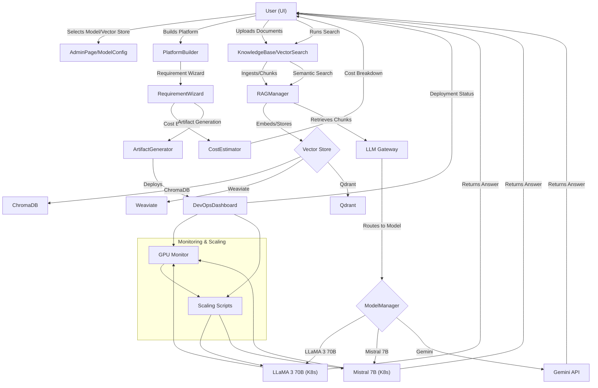

# AI Platform Visual Checklist & Validation Guide

---

## Visual Checklist (Sequence Overview)

1. **User (UI)**
   - Selects model/vector store in AdminPage/ModelConfig
   - Builds a platform via PlatformBuilder (RequirementWizard, CostEstimator, ArtifactGenerator, DevOpsDashboard)
   - Uploads documents and runs semantic search via KnowledgeBase/VectorSearch

2. **Backend Flow**
   - RAGManager handles document chunking, embedding, and storage in the selected vector store (ChromaDB, Weaviate, Qdrant)
   - LLM Gateway and ModelManager route queries to the correct model (LLaMA 3 70B, Mistral 7B, Gemini API)
   - Answers, cost breakdowns, and deployment status are returned to the UI

3. **Infrastructure**
   - Kubernetes manages LLaMA 3 70B and Mistral 7B deployments
   - GPU Monitor and Scaling Scripts handle resource optimization
   - All monitoring and scaling is visible in the Executive Dashboard

---

## Sequence Diagram

---

## Printable Checklist

- [ ] 1. **Deploy LLaMA 3 70B and Mistral 7B on CoreWeave**
  - [ ] Set Hugging Face token
  - [ ] Run `./scripts/deploy-all-models.sh`
  - [ ] Monitor with `./scripts/gpu-monitor.sh`
  - [ ] Scale with `./scripts/scale-model.sh`
- [ ] 2. **Validate Model Endpoints**
  - [ ] Test LLaMA 3 70B endpoint with `curl`
  - [ ] Test Mistral 7B endpoint with `curl`
- [ ] 3. **Check Multi-Model Abstraction**
  - [ ] Switch models in Admin UI
  - [ ] Confirm backend routes to correct model
- [ ] 4. **Validate RAG and Vector Store Integrations**
  - [ ] Configure ChromaDB, Weaviate, Qdrant in Admin UI
  - [ ] Ingest documents and run semantic search
  - [ ] Confirm retrieval from correct vector store
- [ ] 5. **Monitor and Optimize**
  - [ ] Use GPU Monitor and scaling scripts
  - [ ] Review KPIs in Executive Dashboard
- [ ] 6. **End-to-End Validation**
  - [ ] Build a platform, select model/vector store, ingest docs, run search
  - [ ] Confirm correct model/vector store used and results returned in UI

---

## Step-by-Step Validation Table

| Step | Action | How to Validate | UI/Script/API |
|------|--------|-----------------|--------------|
| 1 | Deploy models | Pods running, services up | `kubectl`, scripts |
| 2 | Test endpoints | `curl` returns valid completions | Terminal |
| 3 | Switch models | ModelManager/LLM Gateway logs, UI selection | Admin UI, logs |
| 4 | Configure vector stores | VectorSearch returns real results | Admin UI, API |
| 5 | Ingest/search docs | Search returns relevant chunks | UI, API |
| 6 | Monitor/scale | GPU Monitor shows healthy, scaling works | Scripts, Dashboard |
| 7 | End-to-end | All above steps work in sequence | UI, logs |

---

For more details, see `README.md` and `README-deployment.md`. 